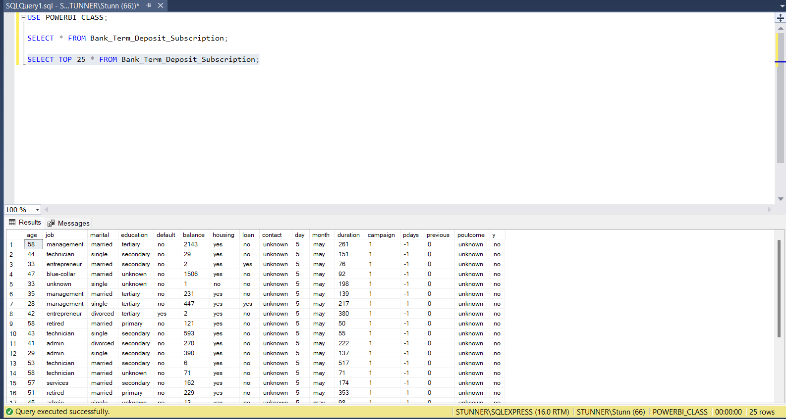

# Importing Dataset Into PowerBI

## INTRODUCTION
I will be establishing a relationship between SQL and PowerBI in a bid to create a create a seamless data bridge.
I will also be showing the importing a file directly into the PowerBi environs for analysis.

## TASK 
1. Import the DATASET ‘Bank Term Deposit Subscription’ into  Power BI Desktop using the csv file option
2. Load the dataset into a database into SQL Server
3. Connect Power BI desktop to this database
4. Import only the first 25 rows into PowerBi desktop for analysis

## EXECUTION
Here is a Correllation shewing step by step guide
Fig 1 Shows the Get File Tab, showing options to use in order to perform an import, featuring varieties of options.

| Fig 1. a                         | Fig 1. b                         |
| -------------------------------- | -------------------------------- |
|      |      |

Fig 2 shows the Preview of the File ‘Bank Term Deposit Subscription’ before it is being loaded into PowerBI

| Fig 2. a                         | Fig 2. b                         |
| -------------------------------- | -------------------------------- |
|      |      |

Fig 3 shows the creation of POWERBI_CLASS on SQL, also the process of bridging SQL into Powerbi, featuring an SQL Filteration code used to capture the Top 25 data from the dataset.

| Fig 3. a                         | Fig 3. b                         |
| -------------------------------- | -------------------------------- |
|      |      |

Fig 4 shows a preview of the data to be imported from SQL into PowerBI just before it is loaded, as well as the final view of the imported data. 

| Fig 4. a                         | Fig 4. b                         |
| -------------------------------- | -------------------------------- |
|      |      |

---

Curated By [**Oshisanya Tokunbo**](https://x.com/Stunner_Guy)

